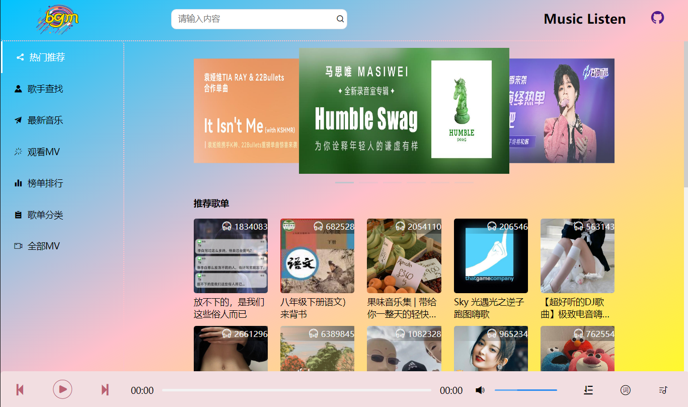
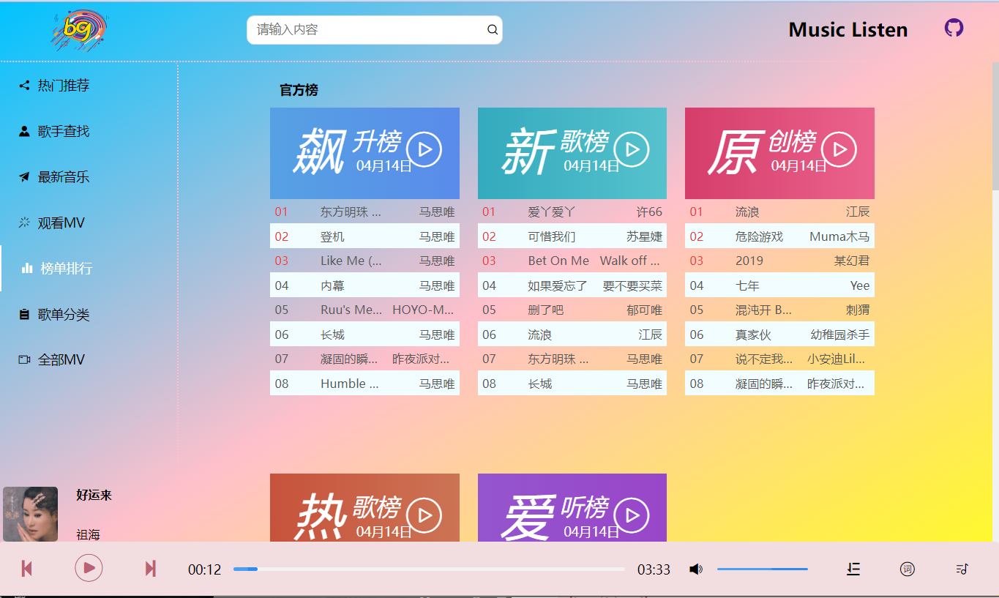
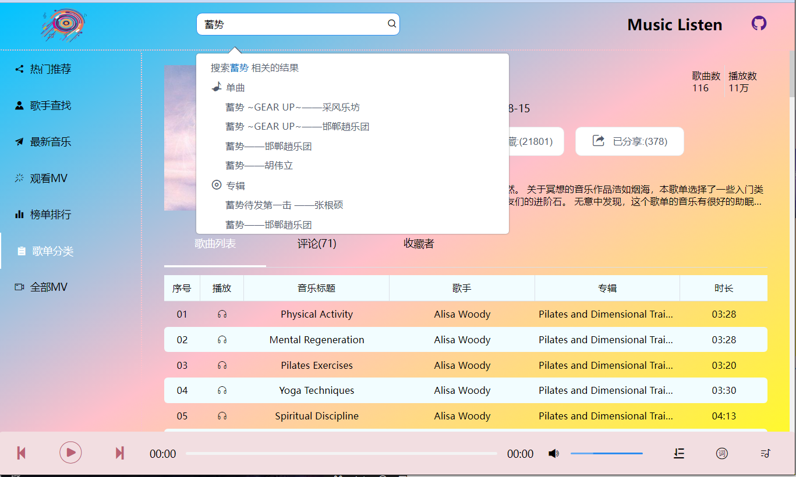
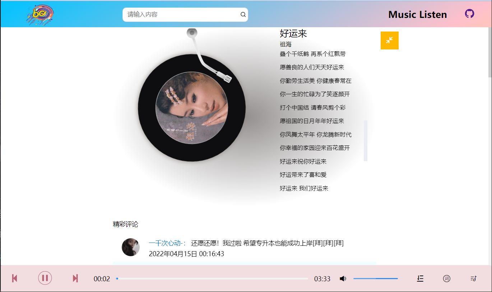

# 项目介绍

项目参考于市面音乐 PC 版 app，基本实现官方音乐播放、MV 播放所有功能

## 效果展示

### 运行项目

1.  运行本仓库代码

		node版本： 18

    1.1. `git clone git@github.com:Fa-ce/Music_Listen.git`

    1.2. `npm install`

    1.3. `npm run serve`

2.  后端 API

    本项目后端所有数据来自开源项目 NeteaseCloudMusicApi，下面附有后端开源项目地址、文档。API 地址默认为文档地址，可以直接访问

    [API 文档]("http://iwenwiki.com:3000/)

    后端 API 仓库地址： `git clone https://github.com/Fa-ce/NeteaseCloudMusicApi.git`，若 API 地址访问不到无法查看效果，可以运行后端服务

    2.1.0 运行后端仓库

    2.1.1. `git clone https://github.com/Fa-ce/NeteaseCloudMusicApi.git`

    2.1.2. `npm install`

    2.1.3. `node run start`

### 排行榜

### 搜索

### 播放详情

